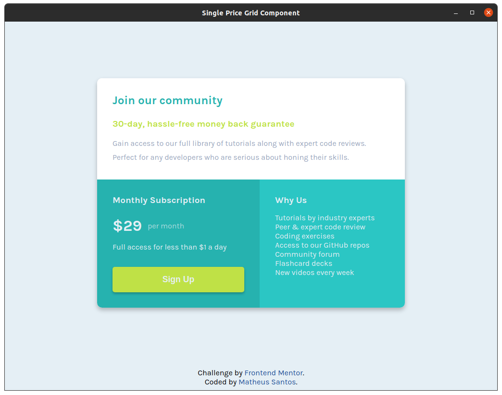
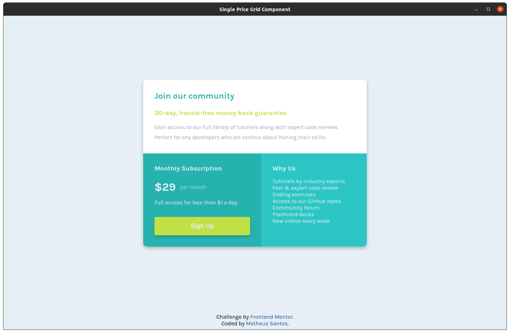
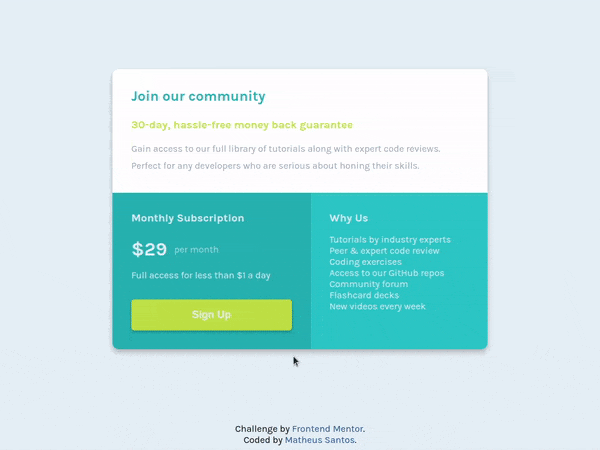

# Frontend Mentor - Single price grid component solution

Esta é a minha solução do desafio "[Single price grid component](https://www.frontendmentor.io/challenges/single-price-grid-component-5ce41129d0ff452fec5abbbc)". O desafio consiste em criar um componente de grid que se adeque a diferente tamanhos de tela e que tenha responsividade no botão.

[Link para a solução](https://matheusg18.github.io/single-price-grid-component/)

## Table of contents

- [Overview](#overview)
  - [Desafio](#desafio)
  - [Screenshots](#screenshots)
  - [Gifs](#gifs)
- [Desenvolvimento](#desenvolvimento)
  - [Tecnologias usadas](#tecnologias-usadas)
  - [Aprendizados](#aprendizados)
- [Contato](#contato)

## Overview

### Desafio

Os usuários devem ser capazes de:

- Ver o layout que mais se adeque ao tamanho de sua tela
- Ver um efeito de _hover_ sobre o botão Sign Up

### Screenshots

#### Layout mobile

#### Layout em 1024x768

#### Layout em 1440x900

### Gifs

#### Efeito de hover

## Desenvolvimento

Para desenvolver este desafio eu usei o Sass pela primeira e já vi o quanto é poderoso.

### Tecnologias usadas

- HTML5
- Sass
- CSS
- Flexbox
- CSS Grid
- Mobile-first

### Aprendizados

- Sass
- Metodologia modular do Sass
- CSS display grid
- Problemas que podem ocorrer com o overflow do display grid

## Contato

- Portfólio - [Matheus Santos](https://matheusg18.github.io/)
- Frontend Mentor - [@matheusg18](https://www.frontendmentor.io/profile/matheusg18)
- Linkedin - [@matheusg18](https://www.linkedin.com/in/matheusg18/)
